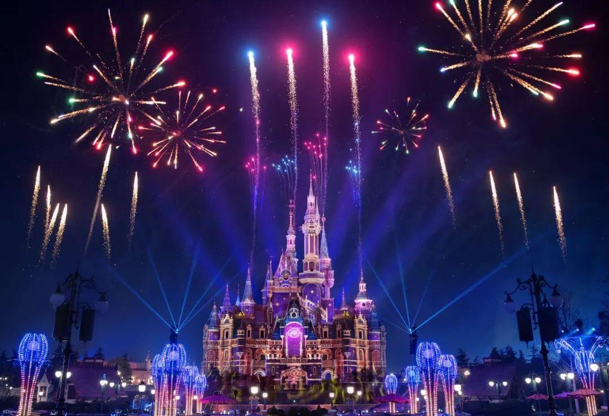

# kxie0860_9103_MajorProject

## Part 1: Instructions 
I have chosen the "**Time**" method to drive my individual code, simulating transitions between day and night in my work. 

The animation cycles **every 12 seconds**, primarily leveraging the `frameCount` to allow for time-based animation:

#### 1-3 seconds:
- Transition from day to night.
- Seagulls gradually disappear.
- Water waves appear in white and purple.

#### 3-9 seconds: Night
- Windows of the building light up.
- Random fireworks bloom in the sky.
- The building is outlined with yellow light, gradually fading.
- Water waves turn yellow.

#### 9-12 seconds:
- Transition from night to day.
- Lights on the building turn off.
- Fireworks stop.
- Seagulls gradually appear.
- Water waves appear in white and purple again.

## Part 2: Individual Approach to Animation

I made adjustments to various parts of the group code:

1. **Building**: Added `lightup()` method for light up the windows during nighttime.
Added an `illuminate()` method for the gradual fading effect after being illuminated.
2. **Wave Brush**: Created waves of different colours, smoothly adjusting their size. Colours transition differently between day and night.
3. **Seagull**: Added a `Alpha` parameter to control the opacity, changing over time.
4. **Gradient Wave**: Adjusted the gradient waves of the sky and sea to align with my project's style, creating a more nuanced scene.

Additionally, I wrote two classes for my individual work:

1. **Night Mask**: A scaleable transparent gradient night mask to create day and night effects.
2. **Firework**: Generates fireworks of random sizes.

## Part 3: Inspiration
My inspiration comes from Disney fireworks, where the buildings display different lighting effects beneath the fireworks, creating a stunning scene.
  

## Part 4: Technical Explanation
Regarding the fireworks effects, I referred to a YouTube tutorial  [Coding fireworks in p5.js!](https://www.youtube.com/watch?v=VxR89QCtZKs) by *MindForCode* for guidance.  

It involves generating particles of random directions, adding animation for vertical movement along the y-axis, and gradual opacity changes to simulate fireworks.

I made two main modifications beyond the basic code:
1. Introduced time events to automatically generate fireworks at random intervals using `frameCount`.
2. Added a `size` parameter to generate fireworks of different sizes.